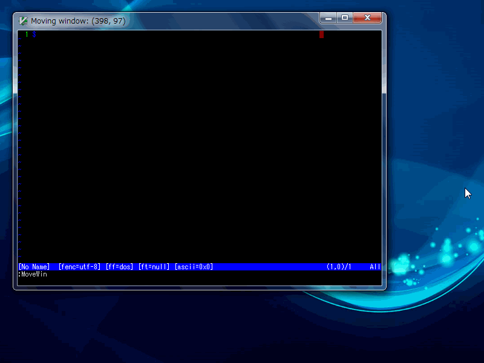

movewin.vim
=====

This Vim plugin was forked from  
  http://www.vim.org/scripts/script.php?script_id=741    

Move Vim window using the keyboard, for those who don't like to use the mouse.  
After loading the script, call :MoveWin.  Use hjkl and shift+hjkl keys to move the window, press any other key when done.  
The original plugin could be used in GUI only. But this forked plugin can be used in Windows-CUI (Command-Prompt) also.  

In addition, comparing with the original plugin, there are some improvements.  
#### First:
Original plugin doesn't distinguish between hjkl and HJKL (hjkl with Shift-key) when the option:ignorecase is set.  
But this plugin distiguishes hjkl and HJKL when option:ignorecase is set.  

#### Second:
This plugin provides interface for key-bind.  
You can use it as follow.  

~~~~VimL
nmap <Left>   <Plug>(movewin-left)
nmap <Down>   <Plug>(movewin-down)
nmap <Up>     <Plug>(movewin-up)
nmap <Right>  <Plug>(movewin-right)
~~~~
